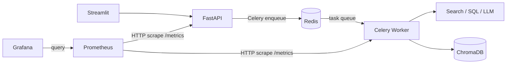

# Multi-Agent AI Research & Automation Platform

End-to-end stack: **orchestrated agents** (research → analysis → writing), **tool use** (web search, SQL demo, safe numeric eval), **RAG** (Chroma + Gemini or OpenAI embeddings), **async jobs** (Celery + Redis), **Streamlit UI**, **Prometheus + Grafana**, optional **RAGAS** evaluation.

## Architecture

**Request path:** Streamlit calls FastAPI; FastAPI **enqueues** work to **Redis**; the **Celery worker** **consumes** tasks from Redis and runs tools + LLM (Chroma for RAG).

**Metrics path:** **Prometheus** *pulls* (HTTP `GET /metrics`) from **FastAPI** and from the **Celery worker** (job counters live on the worker). **Grafana** reads Prometheus (datasource), not your app directly.



## Quick start (Docker)

From this directory:

```bash
cp .env.example .env
# Live LLM + RAG (defaults: LLM_PROVIDER=gemini in Compose)
# - Gemini: set GOOGLE_API_KEY in .env, DEMO_MODE=false
# - OpenAI: set OPENAI_API_KEY, LLM_PROVIDER=openai, DEMO_MODE=false
docker compose up --build
```

| Service    | URL                    |
|-----------|------------------------|
| API docs  | http://localhost:8000/docs |
| Streamlit | http://localhost:8501    |
| Prometheus| http://localhost:19090   |
| Grafana   | http://localhost:3000 (admin/admin) |
| Chroma    | http://localhost:8001    |

**Grafana panels:** Metrics come from the **Celery worker** (`worker:9100`). Run a Streamlit job, set time range to **Last 15 minutes**, refresh. The dashboard uses **`increase(...[5m])`** (not `rate`) so low-traffic runs still show bars. **`rate()`** often looks empty when you only have a few jobs in a short window.

**Smoke test (no API key):** leave `DEMO_MODE=true` (default in Compose). Submit a goal in Streamlit; worker completes with demo steps.

**Production-style run:** set `GOOGLE_API_KEY` (Gemini, default) or `OPENAI_API_KEY` with `LLM_PROVIDER=openai`, set `DEMO_MODE=false`, rebuild.

## API highlights

- `POST /jobs` — enqueue goal; returns `job_id`
- `GET /jobs/{id}/events` — poll agent activity
- `GET /jobs/{id}/result` — JSON + markdown report + citations
- `GET /jobs/{id}/stream` — SSE (optional; UI uses polling)
- `GET /metrics` — Prometheus

## Evaluation

```bash
pip install ragas datasets  # optional
python evaluation/evaluate.py --payload sample_eval.json
```

## GCP Cloud Run (outline)

Build and push API image, deploy with Redis (Memorystore) and managed secrets for `OPENAI_API_KEY`. Run Celery workers as a second Cloud Run service or GKE job. Chroma can be replaced with Vertex AI Vector Search for production.

## Publish to GitHub

From this directory (secrets stay local — **never** commit `.env`):

```bash
git init
git add .
git status   # confirm .env is NOT listed
git commit -m "Initial commit: multi-agent research platform"
```

Create an empty repo on GitHub, then:

```bash
git remote add origin https://github.com/YOUR_USER/YOUR_REPO.git
git branch -M main
git push -u origin main
```

Copy **`.env.example`** → **`.env`** on any machine and fill in keys locally.

## Keywords

LangChain, multi-agent workflows, tool-use, RAG, Chroma, FastAPI, SSE, Celery, Redis, Prometheus, Grafana, Docker, CI/CD.
